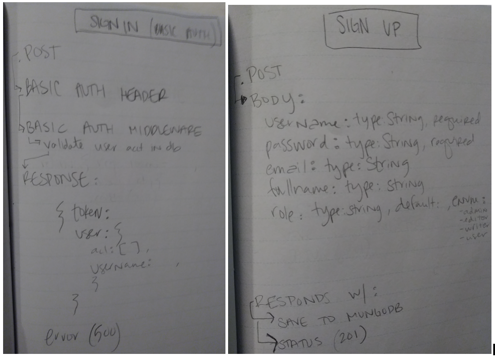

# Auth-Server
Code 401 Lab 11-14 Project
**Description**: 

## See the Site
IF SITE IS PUBLISHED PUT THE LINK HERE

## Author
Tia Low

### About
Full-stack JavaScript developer with a diverse background of personal and professional experience.

## Collaborations and Resources
- Joshua Beasley : [GitHub](https://github.com/beasleyDOTcom)

## Version
1.0.1

## Tech Used
ALL TECH GOES HERE IN LIST FORMAT

## ENV SAMPLES
- PORT=
- MONGODB_URI=
- SECRET=
- GITHUB_CLIENT_ID=
- GITHUB_CLIENT_SECRET=

## Domain Modeling
- MongoDB name: products

## Daily Log
Monday : 8-24-20 : **Phase 1** : **Basic Authentication**
- Create a basic server with the following features:
  - Users Model (Mongoose Schema)
  - /signup route that creates a user
  - /signin route that attempts to log a user in
  - BasicAuth middleware that validates the user as part of the /signin process
  - Return a JSON Web Token on valid sign in attempts

Tuesday : 8-25-20 : **Phase 2** : **OAuth**
- Complete the full OAuth handshaking process
- Create or validate a local user account matching the remote user id
- Return a JSON Web Token on valid sign in attempts

Wednesday : 8-26-20 : **Phase 3** : **Bearer Authentication**
- Re-Authenticate Users
- Accepts a TOKEN in the **Authorization: Bearer** header
- Validates the user
- Allows or Denies access to the route handler

Thursday : 8-27-20 : **Phase 4** : **Authorization**
- Implement a Role Based Authorization System
- Combine the Bearer Token with User roles to give fine grained access control

<!-- ### Swagger Hub Documentation
https://app.swaggerhub.com/apis/TiaLow/online-store/0.1#/info -->

### UML Diagram
**Phase 1**